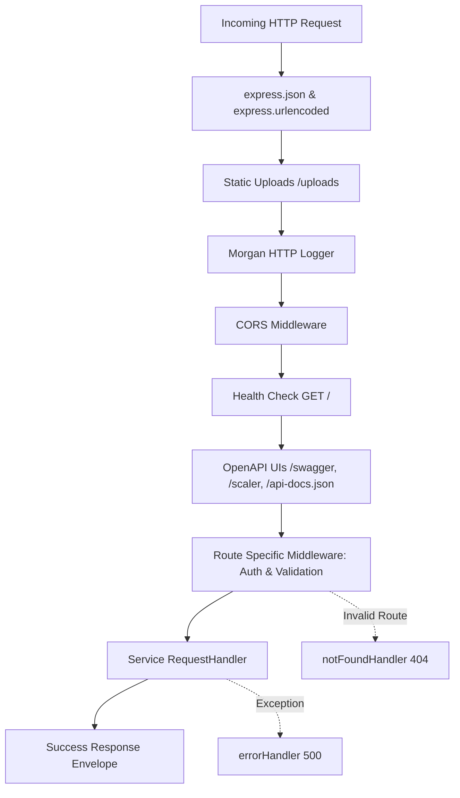

# Node Express Starter — Agent Steering Guide

This steering guide provides the definitive context, architecture specifications, and technical standards for working on this **Express 5 + TypeScript** REST API starter template.

The guide is organized into three core sections:
1. **[Product](#1-product)** — High-level purpose, centralized naming/branding, architecture goals, and core product capabilities.
2. **[Structure](#2-structure)** — Complete file tree, module pattern, scaffolding workflow, database patterns, and middleware pipeline.
3. **[Tech](#3-tech)** — Tech stack specifications, TypeScript rules, helper API references, scripts, linting/formatting, and environment configuration.

---

## 1. Product

### Overview & Mission
This repository is a production-ready, highly structured **Express 5 + TypeScript REST API starter template** built with **Node.js, Express.js, and modern TypeScript tooling**. It is engineered to serve as a solid, scalable boilerplate for RESTful web services and backend APIs, providing a standardized developer framework where every domain module follows an identical, predictable pattern.

### Centralized Application Name & Metadata
The application identity, name, and metadata are centralized in `src/common/constants.ts` under `APP_CONFIG`. Changing the configuration values in this single location automatically updates the metadata across the entire codebase (including OpenAPI documentation, API headers, and server logs):

```typescript
export const APP_CONFIG = {
	name: "node-express-starter",
	displayName: "Node Express Starter",
	title: "Node Express Starter API",
	description:
		"Production-ready REST API starter template built with Node.js, Express 5, and TypeScript",
	version: "1.0.0",
} as const;
```

### Key Capabilities & Core Features
- **Modular Domain Architecture**: Domain resources are completely self-contained within dedicated module directories under `src/api/`, separating routes, schemas, OpenAPI contracts, and isolated service handlers.
- **Automated CLI Module Generator**: Built-in scaffolding script (`script/generate-module.js` / `pnpm generate:module`) to generate standardized top-level or nested sub-modules with zero manual boilerplate.
- **End-to-End Type Safety & Schema Validation**: Runtime request validation powered by **Zod**, seamlessly coupled with **@asteasolutions/zod-to-openapi** for automatic TypeScript type inference and OpenAPI 3.0 specification generation.
- **Dual Interactive API Documentation**: Integrated live interactive documentation with **Scalar UI** (`/scaler`) and **Swagger UI** (`/swagger`), along with the raw JSON OpenAPI schema (`/api-docs.json`).
- **Robust Authentication & RBAC**: JWT Access (15-day) and Refresh Tokens (30-day with cryptographic `jti`), Bcrypt password hashing, 4-digit OTP generation, and composable authorization middlewares for role checks and resource ownership verification.
- **Standardized Response Envelope**: Uniform HTTP responses across all endpoints adhering to the `ApiResponse<T>` contract (`status`, `message`, `data`, `success`, `errors`).
- **Centralized MongoDB Error Translation**: Automatic parsing of Mongoose errors (`CastError`, `ValidationError`, duplicate key `E11000`) into clean, client-friendly HTTP 400 bad request responses.
- **Intelligent Database Defaults**: Global Mongoose plugin (`applyDefaultsPlugin`) registered before model compilation to guarantee that missing fields deserialize to sensible defaults (`""`, `0`, `false`, `[]`) rather than `undefined`.
- **Enterprise Structured Logging**: Daily rotating multi-file logging using **Winston** (`error`, `combined`, `http` logs with automated retention policies), uncaught exception safety handlers, and custom colorized **Morgan** HTTP request logging with client IP tracking.
- **Multipart File Upload Handling**: **Multer** disk storage for image uploads (JPEG, PNG, GIF, WebP, SVG) with a 5MB limit, unique timestamp naming, and static file serving from `/uploads`.
- **Transactional Email Transport**: **Nodemailer** transporter pre-configured for SMTP/Gmail integration.

---

## 2. Structure

### Project File Tree

```
express-ts-starter/
├── .github/
│   ├── dependabot.yml                     # Dependabot package updates config
│   └── workflows/
│       └── build.yml                      # CI build and lint workflow
├── .husky/                                # Git commit hooks
├── api-client/
│   └── test-api.http                      # VS Code REST Client test request collection
├── doc/
│   ├── module-generator.md                # Comprehensive documentation for the module generator
│   └── openapi-pattern.md                 # Detailed OpenAPI registration & schema guidelines
├── script/
│   └── generate-module.js                 # Interactive & flag-driven module scaffolding CLI
├── src/
│   ├── app.ts                             # Express application bootstrap & route assembly
│   ├── api/                               # Domain API modules
│   │   └── example/                       # Canonical reference module
│   │       ├── example.route.ts           # Express Router & side-effect OpenAPI import
│   │       ├── example.validation.ts      # Zod validation schemas & inferred types
│   │       ├── example.openapi.ts         # OpenAPI path & schema definitions
│   │       └── services/
│   │           ├── index.ts               # Barrel export for service handlers
│   │           └── example.service.ts     # Individual action RequestHandler
│   ├── common/
│   │   ├── index.ts                       # Barrel export for common constants
│   │   └── constants.ts                   # APP_CONFIG, openAPITags, and mediaTypeFormat
│   ├── data/
│   │   └── index.ts                       # Static seed or lookup data
│   ├── db/
│   │   ├── index.ts                       # Central db registry mapping keys to Mongoose models
│   │   └── models/                        # Mongoose model definitions
│   │       └── [model].model.ts
│   ├── helpers/
│   │   ├── index.ts                       # Barrel export for helpers
│   │   ├── response-handler.ts            # Standard API response wrappers & ResponseHandler class
│   │   └── mongodb-error-handler.ts       # Mongoose exception mapper & ObjectId validator
│   ├── lib/
│   │   ├── index.ts                       # Barrel export for lib utilities
│   │   ├── apply-defaults.mongoose-plugins.ts # Global Mongoose plugin for sensible defaults
│   │   ├── connect-mongo.ts               # MongoDB connection initializer
│   │   ├── get-my-ip.ts                   # Local network IPv4 address resolver
│   │   ├── jwt.ts                         # JWT sign/verify, bcrypt hash/compare, OTP generator
│   │   ├── logger.ts                      # Winston logger with daily rotating file transports
│   │   ├── morgan.ts                      # Custom colorized Morgan format
│   │   ├── multer.ts                      # Multer disk upload config & file management helpers
│   │   ├── nodemailer.ts                  # Gmail SMTP transporter
│   │   └── openapi.ts                     # OpenAPIRegistry singleton & doc generator
│   └── middleware/
│       ├── index.ts                       # Barrel export for middleware
│       ├── auth.middleware.ts             # requireAuth, requireRole, requireAnyRole, requireOwnership, optionalAuth
│       ├── validation.middleware.ts       # validateBody, validateParams, validateQuery, validate
│       └── common/
│           ├── default-not-found.ts       # 404 Not Found route handler
│           ├── global-error-handler.ts    # Unhandled error & exception middleware
│           └── index.ts                   # Barrel export for common middleware
├── uploads/                               # Static directory for uploaded files (served at /uploads)
├── .env.example                           # Example environment variable template
├── .gitignore                             # Git ignore definitions
├── .oxlintrc.json                         # Oxlint semantic linting rules
├── biome.json                             # Biome formatter & linter configuration
├── globals.d.ts                           # Global TypeScript declarations & Request extensions
├── package.json                           # Scripts and dependency declarations
├── pnpm-lock.yaml                         # Deterministic pnpm lockfile
├── pnpm-workspace.yaml                    # Workspace config (pnpm settings)
├── tsconfig.json                          # TypeScript compiler configuration
└── tsdown.config.ts                       # tsdown production build configuration
```

---

### API Module 4-File Pattern

Every API resource follows a strict 4-part structure within `src/api/[module]/`:

```
src/api/[module]/
├── [module].route.ts          # 1. Express Router & route registrations
├── [module].validation.ts     # 2. Zod schemas & TypeScript type exports
├── [module].openapi.ts        # 3. OpenAPI registry definitions & path registrations
└── services/                  # 4. Business logic handlers
    ├── index.ts               # Barrel export of all service handlers
    └── [action].service.ts    # Single action RequestHandler per file
```

#### 1. `[module].route.ts`
- **Mandatory**: Imports its own `.openapi.ts` as a **side-effect import** at the top of the file to guarantee OpenAPI path registration.
- Exports a named camelCase router (e.g., `export const user: Router = express.Router();`).
- Chains validation middleware (`validateBody`, `validateParams`, `validateQuery`, `validate`) and auth middleware (`requireAuth`, `requireRole`, etc.) before service handlers.

```typescript
import "./user.openapi";
import express, { type Router } from "express";
import { requireAuth, validateBody, validateParams } from "@/middleware";
import { createUser, getUserById, getAllUsers } from "./services";
import { CreateUserSchema, UserIdSchema } from "./user.validation";

export const user: Router = express.Router();

user.get("/", getAllUsers);
user.get("/:id", validateParams(UserIdSchema), getUserById);
user.post("/", requireAuth, validateBody(CreateUserSchema), createUser);
```

#### 2. `[module].validation.ts`
- Always calls `extendZodWithOpenApi(z)` at the top of the file.
- Defines a base schema, then derives create/update/param/response schemas using `.omit()`, `.partial()`, etc.
- Uses `.openapi("SchemaName")` to attach metadata for Swagger/Scalar documentation.
- Exports inferred TypeScript types via `z.infer<typeof Schema>`.

```typescript
import { extendZodWithOpenApi } from "@asteasolutions/zod-to-openapi";
import { z } from "zod";

extendZodWithOpenApi(z);

export const UserSchema = z.object({
  _id: z.string().openapi({ description: "User unique ID", example: "66f1a2b3c4d5e6f7a8b9c0d1" }),
  name: z.string().min(1, "Name is required").openapi({ description: "Full name", example: "John Doe" }),
  email: z.string().email("Invalid email").openapi({ description: "Email address", example: "john@example.com" }),
  role: z.enum(["customer", "contractor", "admin"]).openapi({ description: "User role" }),
  createdAt: z.date().optional(),
  updatedAt: z.date().optional(),
}).openapi("User");

export const CreateUserSchema = UserSchema.omit({ _id: true, createdAt: true, updatedAt: true }).openapi("CreateUser");
export const UpdateUserSchema = UserSchema.partial().openapi("UpdateUser");
export const UserIdSchema = z.object({ id: z.string().min(1) }).openapi("UserIdParam");

export const UserResponseSchema = z.object({
  status: z.number(),
  message: z.string(),
  data: UserSchema.nullable(),
  success: z.boolean(),
}).openapi("UserResponse");

export type User = z.infer<typeof UserSchema>;
export type CreateUser = z.infer<typeof CreateUserSchema>;
export type UpdateUser = z.infer<typeof UpdateUserSchema>;
```

#### 3. `[module].openapi.ts`
- Imports `registry` from `@/lib/openapi` and `openAPITags`, `mediaTypeFormat` from `@/common/constants`.
- Registers named schemas via `registry.register()`.
- Registers endpoint documentation via `registry.registerPath()` for each method and path.
- Always documents appropriate HTTP response codes (`200`/`201`, `400`, `401`/`403`, `404`, `500`).
- Adds `security: [{ bearerAuth: [] }]` for protected endpoints.

```typescript
import { registry } from "@/lib/openapi";
import { openAPITags, mediaTypeFormat } from "@/common/constants";
import { CreateUserSchema, UserResponseSchema } from "./user.validation";

registry.register("CreateUser", CreateUserSchema);
registry.register("UserResponse", UserResponseSchema);

registry.registerPath({
  method: "post",
  path: "/api/user",
  summary: "Create a new user",
  tags: ["User"],
  security: [{ bearerAuth: [] }],
  request: {
    body: {
      content: {
        [mediaTypeFormat.json]: { schema: CreateUserSchema },
      },
    },
  },
  responses: {
    201: {
      description: "User created successfully",
      content: { [mediaTypeFormat.json]: { schema: UserResponseSchema } },
    },
    400: { description: "Validation error" },
    401: { description: "Unauthorized" },
    500: { description: "Internal server error" },
  },
});
```

#### 4. `services/[action].service.ts`
- Each service file exports a single, dedicated `RequestHandler`.
- **Never call `res.json()` directly** — always return response helpers (`sendSuccess`, `sendCreated`, `sendBadRequest`, etc.) from `@/helpers`.
- Wraps database operations in `try / catch` blocks and uses `exceptionErrorHandler(error, res, defaultMessage)` from `@/helpers`.

```typescript
import type { RequestHandler } from "express";
import { sendCreated, exceptionErrorHandler } from "@/helpers";
import { db } from "@/db";

export const createUser: RequestHandler = async (req, res) => {
  try {
    const newUser = await db.user.create(req.body);
    return sendCreated(res, "User created successfully", newUser);
  } catch (error) {
    return exceptionErrorHandler(error, res, "Failed to create user");
  }
};
```

---

### Module Generator CLI

The codebase includes an automated generator at `script/generate-module.js` that creates the complete 4-file structure.

#### Usage
```bash
# Interactive mode (prompts for module name)
pnpm generate:module

# Direct top-level module generation
pnpm generate:module --module user

# Nested sub-module generation (e.g. src/api/admin/user/)
pnpm generate:module --sub admin --module user
```

#### Naming & Export Conventions
- **Top-level modules** (e.g. `--module user`):
  - Path: `src/api/user/`
  - Route file: `user.route.ts`
  - Router export: `export const user: Router = ...`
  - Route base path: `/api/user`
- **Nested sub-modules** (e.g. `--sub admin --module user`):
  - Path: `src/api/admin/user/`
  - Route file: `user.route.ts`
  - Router export: `export const adminUser: Router = ...` (camelCase combination of parent + module)
  - Route base path: `/api/admin/user`

#### 5-Step Post-Generation Lifecycle
After generating a new module:
1. **Define Schemas**: Flesh out fields in `[module].validation.ts`.
2. **Create Mongoose Model**: Create `src/db/models/[model].model.ts`.
3. **Register Model in DB Index**: Add model to `db` object in `src/db/index.ts`.
4. **Implement Business Logic**: Create granular handlers in `services/` and export in `services/index.ts`.
5. **Mount Router in `src/app.ts`**: Import and mount the router before `notFoundHandler`:
   ```typescript
   import { user } from "@/api/user/user.route";
   // ...
   app.use("/api/user", user);
   ```

---

### Database Architecture & Model Registry

Mongoose models are centralized under `src/db/`:

1. **Model Definition (`src/db/models/[model].model.ts`)**:
   ```typescript
   import mongoose from "mongoose";

   const userSchema = new mongoose.Schema(
     {
       name: { type: String, required: true },
       email: { type: String, required: true, unique: true },
       role: { type: String, enum: ["customer", "contractor", "admin"], default: "customer" },
     },
     { timestamps: true }
   );

   export const User = mongoose.model("User", userSchema);
   ```

2. **Model Registry (`src/db/index.ts`)**:
   ```typescript
   import { User } from "./models/user.model";

   export const db = {
     user: User,
   };
   ```

3. **Global Defaults Plugin (`src/lib/apply-defaults.mongoose-plugins.ts`)**:
   - Registered globally via `mongoose.plugin(applyDefaultsPlugin)` inside `connectDB()`.
   - Intercepts document initialization (`post("init")`) and JSON serialization (`toObject` / `toJSON`).
   - Automatically populates missing or undefined fields with sensible fallbacks: `String` &rarr; `""`, `Number` &rarr; `0`, `Boolean` &rarr; `false`, `Array` &rarr; `[]`.

---

### Middleware Pipeline & Request Flow

The Express application in `src/app.ts` executes middleware in the following strict order:



1. **Body Parsing**: `express.json()`, `express.urlencoded({ extended: true })`
2. **Static Assets**: `express.static("uploads")` mounted at `/uploads`
3. **HTTP Logging**: Morgan with custom colorized format (`morganDevFormat`)
4. **CORS**: Configured origins and allowed headers/methods
5. **Documentation Endpoints**: `/swagger`, `/scaler`, `/api-docs.json`
6. **API Routes**: Mounted domain routers (e.g. `/api/user`)
7. **404 Handler**: `notFoundHandler` catches unmatched routes
8. **500 Global Error Handler**: `errorHandler` formats unhandled exceptions

---

### Centralized Constants & OpenAPI Integration

Application metadata, path prefixes, and tags are centralized in `src/common/constants.ts`:

```typescript
export const APP_CONFIG = {
  name: "node-express-starter",
  displayName: "Node Express Starter",
  title: "Node Express Starter API",
  description: "Production-ready REST API starter template built with Node.js, Express 5, and TypeScript",
  version: "1.0.0",
} as const;

export const openAPITags = {
  example: { name: "Example", basepath: "/api/example" },
};

export const mediaTypeFormat = {
  json: "application/json",
  form: "multipart/form-data",
};
```

> [!IMPORTANT]
> **OpenAPI Document Generation Order**:
> In `src/app.ts`, all route files (which trigger `.openapi.ts` side-effect imports) **must be imported before** `generateOpenAPIDocument()` is invoked.

---

## 3. Tech

### Tech Stack Matrix

| Category | Technology / Package | Version | Purpose |
|---|---|---|---|
| **Runtime** | Node.js (with `tsx`) / Bun | Node >= 20 / Bun | Modern TypeScript execution and hot reload |
| **Framework** | `express` | `^5.1.0` | Next-generation Express 5 with native async support |
| **Database** | `mongoose` / `mongodb` | `^8.19.2` / `^6.20.0` | ODM & MongoDB driver |
| **Validation** | `zod` | `^4.1.12` | Schema validation and type inference |
| **OpenAPI** | `@asteasolutions/zod-to-openapi` | `^8.1.0` | Zod schema transformation to OpenAPI 3.0 |
| **API Docs UI** | `@scalar/express-api-reference`<br>`swagger-ui-express`<br>`openapi3-ts` | `^0.8.22`<br>`^5.0.1`<br>`^4.5.0` | Dual interactive documentation interfaces (Scalar & Swagger) |
| **Authentication** | `jsonwebtoken`<br>`bcryptjs` | `^9.0.2`<br>`^3.0.2` | JWT access/refresh token lifecycle and password hashing |
| **File Uploads** | `multer` | `^2.0.2` | Multipart form-data processing with MIME filters |
| **Email** | `nodemailer` | `^7.0.10` | SMTP email transport |
| **Logging** | `winston`<br>`winston-daily-rotate-file`<br>`morgan`<br>`chalk` | `^3.18.3`<br>`^5.0.0`<br>`^1.10.1`<br>`^5.6.2` | Structured multi-file rotation logging & colorized HTTP logs |
| **Build** | `tsdown` | `^0.15.9` | High-speed esbuild-based bundler with DTS generation |
| **Linting & Formatting** | `@biomejs/biome`<br>`oxlint`<br>`husky`<br>`lint-staged` | `2.2.6`<br>`^1.24.0`<br>`^9.1.7`<br>`^16.2.6` | Fast formatting, semantic linting, and git hooks |
| **Configuration** | `dotenv` | `^17.2.3` | Environment variable management |

---

### Package Management & Scripts

> [!CAUTION]
> **Strict Package Manager Rule**: Always use **`pnpm`** (`pnpm@10.18.3`). Never use `npm` or `yarn`.

| Script | Command | Purpose |
|---|---|---|
| `pnpm dev` | `tsx watch src/app.ts` | Local development server with file watching |
| `pnpm dev:b` | `bun --hot src/app.ts` | Development server powered by Bun |
| `pnpm build` | `tsdown` | Production bundle & TypeScript declaration build |
| `pnpm start` | `node dist/app.js` | Run compiled production bundle |
| `pnpm compile` | `bun build --compile ...` | Compile standalone binary server executable via Bun |
| `pnpm check-types` | `tsc -b` | TypeScript project type-check without emit |
| `pnpm check` | `oxlint` | Fast semantic TypeScript lint check |
| `pnpm format` | `biome format --write ./src` | Code formatting with Biome |
| `pnpm generate:module` | `node script/generate-module.js` | Scaffold a new API domain module |
| `pnpm ruler:apply` | `pnpm dlx @intellectronica/ruler@latest apply --local-only` | Apply AI cursor / IDE agent steering rules |

---

### TypeScript Configuration & Standards

- **Path Alias**: `@/*` maps directly to `./src/*` across all source files. Always use `@/` for internal imports.
- **Verbatim Module Syntax**: `verbatimModuleSyntax: true` is enforced. All type-only imports **must** use `import type`:
  ```typescript
  import type { Request, Response, NextFunction, RequestHandler } from "express";
  ```
- **Strict Mode**: Full TypeScript strict mode enabled (`strict: true`, `target: ESNext`, `moduleResolution: bundler`).
- **Global Type Augmentation**:
  - `Express.Request.user`: `{ userId: string; email: string; role: "customer" | "contractor" | "admin" }` (in `src/middleware/auth.middleware.ts`).
  - `Express.Request.body`: Extensible request body definitions (in `globals.d.ts`).

---

### Formatting & Linting Strategy

The project utilizes a specialized dual toolchain:
- **Biome (`biome.json`)**: Handles code formatting (indentation with **tabs**, **double quotes**, and automatic import organization).
- **Oxlint (`.oxlintrc.json`)**: Provides blazing-fast semantic linting checks (catches floating promises, unused variables, regex issues, and unsafe async operations).
- **Pre-commit**: `husky` triggers `lint-staged` on all staged TypeScript/JavaScript files to run `oxlint` before commits.

---

### Core Helper & Utility Reference

#### 1. Response Helpers (`@/helpers/response-handler.ts`)
Standard response format across all endpoints:
```json
{
  "status": 200,
  "message": "Resource fetched successfully",
  "data": { ... },
  "success": true
}
```

| Helper Function | HTTP Status | Description |
|---|---|---|
| `sendSuccess(res, status?, message, data?)` | 200 (or custom 2xx) | Standard successful data response |
| `sendCreated(res, message, data)` | 201 | New resource creation response |
| `sendNoContent(res)` | 204 | Successful deletion with no body |
| `sendBadRequest(res, message?, errors?)` | 400 | Validation error or bad user input |
| `sendUnauthorized(res, message?)` | 401 | Missing, expired, or invalid JWT |
| `sendForbidden(res, message?)` | 403 | Authenticated user lacks required role/permission |
| `sendNotFound(res, message?)` | 404 | Resource not found |
| `sendInternalError(res, message?)` | 500 | Unhandled server error (logs to Winston) |
| `createResponseHandler(res)` | Chainable class | Instance of `ResponseHandler` for method chaining |

#### 2. MongoDB Error Handler (`@/helpers/mongodb-error-handler.ts`)
- **`exceptionErrorHandler(error, res, defaultMessage)`**: Catches Mongoose errors and returns appropriate HTTP responses:
  - `CastError` &rarr; 400 (`"Invalid ID format provided"`)
  - `ValidationError` &rarr; 400 (Maps field paths and validation messages)
  - Duplicate key error (`E11000`) &rarr; 400 (`"Duplicate value for <field>"`)
  - Other errors &rarr; 500 internal server error
- **`validateObjectIds(ids: string[])`**: Utility returning `{ isValid: boolean, invalidIds: string[] }`.

#### 3. Authentication & RBAC Middleware (`@/middleware/auth.middleware.ts`)
- **`requireAuth`**: Validates `Authorization: Bearer <token>`, decodes payload, and populates `req.user`.
- **`requireRole("admin")`**: Ensures `req.user.role` matches the specified role.
- **`requireAnyRole(["customer", "admin"])`**: Checks if `req.user.role` is included in the allowed roles array.
- **`requireOwnership("id")`**: Verifies that `req.user.userId === req.params[id]` (admins automatically bypass).
- **`optionalAuth`**: Populates `req.user` if a valid token exists, without throwing errors if omitted.

#### 4. Validation Middleware (`@/middleware/validation.middleware.ts`)
- **`validateBody(Schema)`**: Parses `req.body` and attaches typed output.
- **`validateParams(Schema)`**: Parses route parameters (`req.params`).
- **`validateQuery(Schema)`**: Validates query parameters (`req.query` assigned cleanly for Express 5 compatibility).
- **`validate({ body?, params?, query? })`**: Combined multi-target validation.

#### 5. JWT & Cryptography Utilities (`@/lib/jwt.ts`)
- `signAccessToken(payload)`: Generates 15-day access token.
- `signRefreshToken(payload)`: Generates 30-day refresh token with a cryptographic 16-byte hex `jti`.
- `verifyAccessToken(token)` / `verifyRefreshToken(token)`: Validates and returns decoded token payload.
- `hashPassword(password)` / `comparePassword(password, hash)`: Bcrypt hashing (10 salt rounds).
- `generateOTP()`: Generates 4-digit numeric string OTP.

#### 6. Structured Logging (`@/lib/logger.ts`)
- Winston instance logging to console (colorized in dev) and daily-rotating files under `logs/`:
  - `logs/error-YYYY-MM-DD.log` (14-day retention, 20MB max)
  - `logs/combined-YYYY-MM-DD.log` (14-day retention, 20MB max)
  - `logs/http-YYYY-MM-DD.log` (7-day retention, 20MB max)
- Helper functions: `logInfo(msg, meta)`, `logError(msg, err, meta)`, `logWarn(msg, meta)`, `logDebug(msg, meta)`, `logHttp(msg, meta)`.

#### 7. File Upload Service (`@/lib/multer.ts`)
- `upload.single("file")` / `upload.array("files", maxCount)`: Multer disk storage targeting `uploads/`.
- Permitted image types: JPEG, PNG, GIF, WebP, SVG (5MB size limit).
- `getFileUrl(filename)`: Returns `/uploads/${filename}` URL.
- `deleteFile(filename)`: Asynchronously unlinks file from the uploads directory.

#### 8. Email Transporter (`@/lib/nodemailer.ts`)
- `nodemailerTransporter`: Pre-configured Nodemailer Gmail SMTP instance consuming `SMTP_USER` and `SMTP_PASS`.

---

### Environment Variables

| Variable | Description | Default / Example |
|---|---|---|
| `DATABASE_URL` | MongoDB connection URI | `mongodb://localhost:27017` |
| `PORT` | HTTP server listening port | `4000` (or `5000` default fallback) |
| `API_BASE_URL` | Base API URL used in OpenAPI server configuration | `http://localhost:4000` |
| `CORS_ORIGIN` | Allowed CORS origins | `http://localhost:3000` |
| `ACCESS_SECRET` | JWT Access Token secret key | Secret string (must set in production) |
| `REFRESH_SECRET` | JWT Refresh Token secret key | Secret string (must set in production) |
| `LOG_LEVEL` | Winston logger threshold level | `info` |
| `SMTP_USER` | Gmail / SMTP email address | `example@gmail.com` |
| `SMTP_PASS` | Gmail app password / SMTP credentials | `xxxx xxxx xxxx xxxx` |

---

### CI/CD Workflow Standards

When maintaining the GitHub Actions workflow (`.github/workflows/build.yml`):
- Setup `pnpm` before Node.js using `pnpm/action-setup@v3`.
- Install dependencies using `pnpm install --frozen-lockfile`.
- Run type checks with `pnpm check-types`.
- Run linting with `pnpm check`.
- Build production assets with `pnpm build`.
